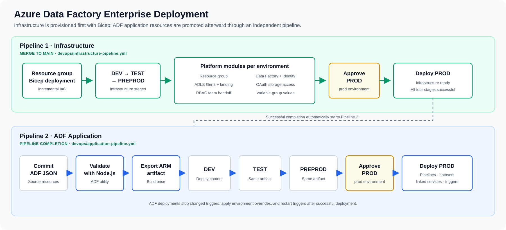

# Azure Data Factory CI/CD

Portfolio project by Jayalakshmi Kumar.

## Scope

This repository demonstrates a professional CI/CD structure for Azure Data Factory deployments using Azure DevOps, YAML templates and ARM templates.

It focuses on the release engineering pattern rather than a specific business dataset:

1. Validate Data Factory resources during CI.
2. Export Data Factory resources as ARM template artifacts.
3. Deploy the same artifact to DEV, QA and PROD.
4. Use environment-specific parameter files.
5. Stop and restart ADF triggers around deployment.
6. Use an Azure DevOps Environment approval gate before production.

## Architecture



## Repository Structure

```text
pipelines/azure-pipelines.yml       Main multi-stage pipeline
pipelines/templates/ci-build.yml    CI template for validation/export
pipelines/templates/cd-deploy.yml   CD template for deployments
pipelines/parameters/               Environment-specific ARM parameters
package.json                        ADF utility package and formatting script
docs/                               Operational notes
```

## Best Practices Demonstrated

- Reusable YAML templates for CI and CD.
- One build artifact promoted across environments.
- Consistent artifact naming between build and deploy stages.
- Environment-specific parameterization instead of hard-coded values.
- Production approval gate through Azure DevOps Environments.
- Trigger stop/start workflow to avoid deployment conflicts.
- No secrets committed to source control.

## Delivery Highlights

- Replaced manual deployment steps with a repeatable Azure DevOps release flow.
- Validates Azure Data Factory resources before producing deployable ARM template artifacts.
- Promotes the same validated artifact through DEV, QA and PROD for better release consistency.
- Uses environment-specific parameter files so configuration changes are separated from pipeline logic.
- Stops and restarts ADF triggers around deployment to reduce release-time conflicts.
- Adds a production approval gate to support controlled enterprise release management.
